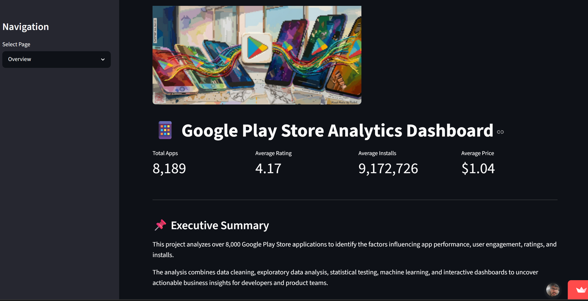
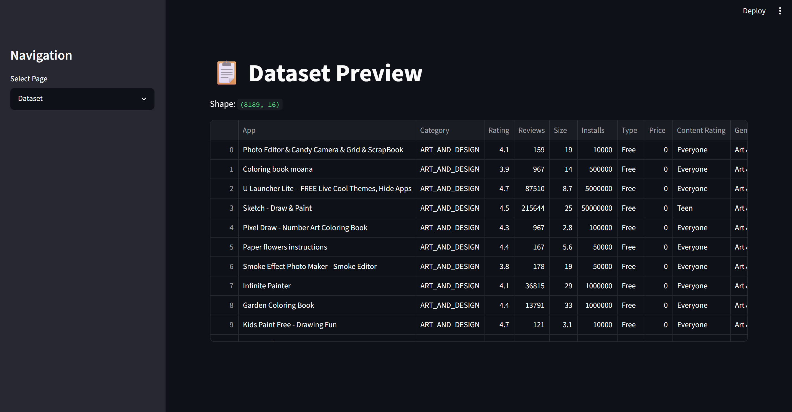
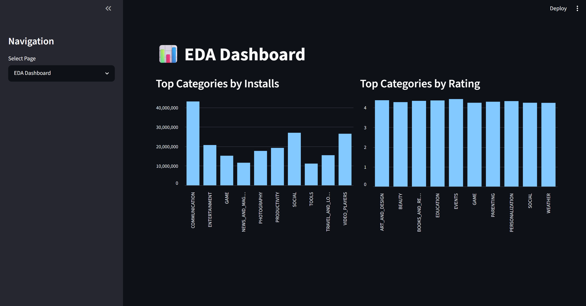
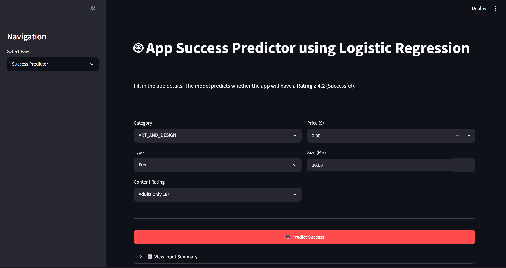
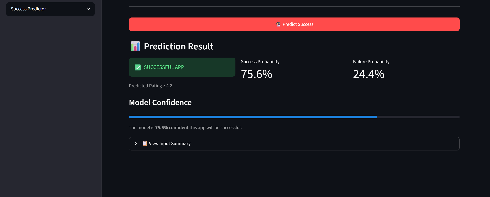

# 📱 Google Play Store Analytics & App Success Prediction

## 🚀 Project Overview

This project analyzes Google Play Store applications using Data Cleaning, Exploratory Data Analysis (EDA), Inferential Statistics, Feature Engineering, Machine Learning, and an Interactive Streamlit Dashboard.

The objective is to identify the factors that contribute to app success and build a predictive model that estimates an application's success category based on characteristics such as category, pricing strategy, content rating, and app size.

---

## 🎯 Business Problem

Developers often struggle to determine whether an app idea is likely to succeed before launch.

This project aims to answer:

- Which categories perform best?
- Do free apps outperform paid apps?
- How do ratings and reviews impact installs?
- Which factors influence app success?
- Can we predict app success before launch?

---

## 📂 Dataset

The project uses two datasets:

### 1. Google Play Store Apps Dataset

Contains:

- App Name
- Category
- Rating
- Reviews
- Size
- Installs
- Type
- Price
- Content Rating
- Genres
- Android Version
- Current Version

### 2. Google Play Store User Reviews Dataset

Contains:

- User Reviews
- Sentiment
- Sentiment Polarity
- Sentiment Subjectivity

---

## 🛠️ Tech Stack

### Languages & Libraries

- Python
- Pandas
- NumPy
- Matplotlib
- Seaborn
- Scikit-Learn
- SciPy
- Joblib

### Dashboard

- Streamlit

### Development Environment

- Jupyter Notebook
- VS Code

---

# 📊 Exploratory Data Analysis

The project includes:

### Data Understanding

- Dataset Shape
- Data Types
- Missing Values
- Duplicate Analysis

### Data Cleaning

- Missing Value Treatment
- Duplicate Removal
- Data Type Conversion
- Install Count Cleaning
- Price Cleaning
- Feature Standardization

### Univariate Analysis

- Rating Distribution
- Reviews Distribution
- Installs Distribution
- Price Distribution
- Category Distribution

### Bivariate Analysis

- Reviews vs Installs
- Rating vs Reviews
- Free vs Paid Apps
- Category vs Ratings

### Multivariate Analysis

- Correlation Analysis
- Sentiment Analysis
- Category Performance Analysis

---

# 📈 Statistical Analysis

## Descriptive Statistics

Calculated:

- Mean
- Median
- Standard Deviation
- Variance
- Skewness
- Kurtosis
- Quartiles

## Inferential Statistics

### Independent T-Test

**Objective:**

Compare ratings of Free vs Paid Apps

### ANOVA

**Objective:**

Determine whether ratings differ significantly across app categories.

---

# 🤖 Machine Learning

## Problem Statement

Predict App Success Category using app characteristics.

### Target Variable

Success Category:

- Low
- Medium
- High

### Features Used

- Category
- Type
- Content Rating
- Price
- Size

### Models Implemented

- Logistic Regression
- Random Forest Classifier

### Evaluation Metrics

- Accuracy Score
- Precision
- Recall
- F1 Score
- Feature Importance

---

# 🗄️ SQL Analytics

A complete MySQL analytics workflow was implemented before Python analysis.

### Data Cleaning

* Imported 10,841 app records and 64,295 review records using `LOAD DATA LOCAL INFILE`
* Removed corrupted records
* Handled duplicate apps using `ROW_NUMBER()`
* Cleaned Installs, Price, and Size columns
* Created an analytics-ready table (`googleplaystore_clean`)

### Advanced SQL Concepts Demonstrated

* Common Table Expressions (CTEs)
* Multiple CTEs
* Window Functions (`ROW_NUMBER`, `DENSE_RANK`)
* Date Functions (`STR_TO_DATE`, `YEAR`)
* Joins
* Conditional Aggregation
* Query Optimization
* Sentiment Analysis

### Business Analysis Performed

* Top Categories by Installs
* Free vs Paid App Analysis
* Content Rating Analysis
* Category Performance Analysis
* Sentiment Analysis by Category
* Top Apps Within Each Category
* App Update Trends


---

# 📊 Key Insights

* GAME category generated over **13.4 Billion installs**, making it the largest category on the platform.
* Free apps significantly outperformed paid apps in both installs and user engagement.
* Education achieved the highest average rating (4.31), indicating strong user satisfaction.
* Apps rated **Everyone** dominated the marketplace by total app count.
* Categories such as Video Players, Social, Photography, and Entertainment performed above platform averages.
* Positive review sentiment was observed across most major categories.
* The majority of applications were updated during 2018, highlighting rapid ecosystem growth.
* User engagement follows a winner-takes-most pattern where a small number of apps capture most installs and reviews.

---

# 🖥️ Streamlit Dashboard

An interactive dashboard was developed to visualize insights and allow app success prediction.

link - https://knihrsafpfuwk3g9au8q5e.streamlit.app/

### Features

- Dataset Overview
- KPI Metrics
- EDA Dashboard
- Interactive Success Predictor

---

# 📸 Dashboard Screenshots

## Dashboard Overview



## Dataset Preview



## EDA Dashboard



## Success Predictor



## Additional Dashboard View



---

# 📁 Project Structure

```text
googleplaystore/
│
├── app.py
├── requirements.txt
├── README.md
│
├── SQL/
│   └── eda.sql
│
├── dataset/
│   ├── googleplaystore.csv
│   └── googleplaystore_user_reviews.csv
│
├── cleaned dataset/
│   └── googleplaycleaneddf.xlsx
    └── googleplaystore_cleaned.csv
│
├── ML Models/
│   ├── LogisticRegression.ipynb
│   └── LinearRegression.ipynb
│
├── screenshots/
│   ├── sc1.png
│   ├── sc2.png
│   ├── sc3.png
│   ├── sc4.png
│   └── sc5.png
│
└── googleplayeda.ipynb
```

---

# 💼 Business Applications

This project can help:

- App Developers
- Product Managers
- Marketing Teams
- Data Analysts

understand:

- Factors driving app success
- High-performing categories
- User engagement patterns
- Impact of pricing strategy
- App launch planning

---

# 📚 Skills Demonstrated

- Data Cleaning
- Data Wrangling
- Exploratory Data Analysis
- Descriptive Statistics
- Inferential Statistics
- Hypothesis Testing
- ANOVA
- Feature Engineering
- Machine Learning
- Streamlit Development
- Data Visualization
- Business Insight Generation

---

# 👨‍💻 Author

**Swapnil Nicolson Dadel**

Aspiring Data Analyst passionate about:

- Data Analytics
- Statistics
- Machine Learning
- Business Intelligence
- Power BI
- Python
- SQL
- GenAI

---

⭐ If you found this project useful, consider giving it a star.

contact - swapnilnicolson.201@gmail.com
